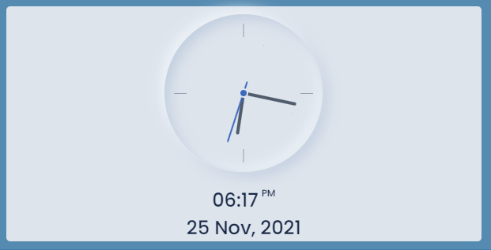
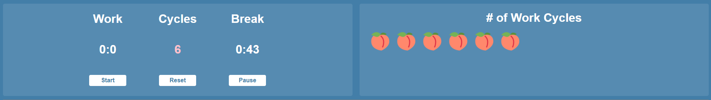

# Personal Dash

A personal productivity Web App that mimics a dashboard layout.<br />
A Live Demo of the app can be found here: [Live Site](https://kenrickoliver.github.io/personaldash/).

Some of the Apps main features include:
- Consuming data from 3rd party APIs to fetch random quotes.
- Uses the built in geolocation web API to get current user position to then fetch the weather based on location.
- Simple CRUD functionality with the ability to create/edit/delete notes.
- Notes also get saved to localStorage(persistent data).
- Fully Responsive Web App.

## Features

### Display random motivational quote

This is one of the simpler features of this App. All we are doing is dispalying a random motivational quote in the top left hand corner of the app. The quotes are fetched from a 3rd party API and we are using a random number to select which quote we use.
```
function getQuote() {
  fetch("https://type.fit/api/quotes")
    .then((res) => res.json())
    .then((data) => {
      let randInd = Math.floor(Math.random() * data.length);
      let auth = data[randInd].author ? data[randInd].author : "Unknown";
      quote.innerHTML = `${data[randInd].text}`;
      author.innerHTML = `${auth}`;
    })
    .catch((err) => {
      console.log(err);
      let txt = "Once you choose hope, anythings possible.";
      let auth = "Christopher Reeve";
      quote.innerHTML = `${txt}`;
      author.innerHTML = `${auth}`;
    });
}
getQuote();

```
We are using the built in fetch function in JavaScript to make the API call. We fetch the quote AND the author of said quote.
Sometimes there is no author so we conditonally check for this and then just display "Unknown" if no author is provided.<br />
As you can see we are also error checking using the .catch method and we have a default fallback quote we can display incase something goes wrong when we make the API call.<br />
Lastly, as soon as the app loads the getQuote function is called so each time the app is loaded OR refreshed, it should trigger an API call to get a differnt quote.

### Display weather based on location

This feature also makes a request to a 3rd party API, specifically the Open Weather API.
The difference between this feature compared to the quotes feature is that it relies on addtional data BEFORE making the API call.
We are using the built in geolocation feature available in the browser to get the user's current location. 
We then make a call to the weather API to get the weather and other info based on the location we obtained.

```
const getPosition = () => {
  return new Promise((resolve, reject) => {
    navigator.geolocation.getCurrentPosition(resolve, reject);
  });
};

const getWeather = () => {
  getPosition()
    .then((position) => {
      const { latitude: lat, longitude: lon } = position.coords;

...

```

### Display Date and Time as well as a visual Clock

This feature while simple, leans into CSS a bit more to render a clock on the screen but ALSO the date and time underneath in a very readable font.



### Work Cycles with Timer

This feature is my variation of the popular pomodoro timer productivity tool.
While there are various versions and time variations of the pomodoro timer, the most common times are 25 minutes of work with a 5min break time.



For the purpose of showcasing the demo version of this app/feature I reduced the work timer and break timer to 1min each.<br />
I also added a visual indicator besides the timer functions to display a peach png upon successful completion of one FULL rotation (called a cycle) consistiing of 1 work session and 1 break session. The number of pngs should mach up with the Cycles indicator. This is done by manipulating the DOM and appending a new image as a li(list item) and then appending that to a ul(unordered list).

```
// Tracking Cycles via pomos
function addItem() {
  let newImage = document.createElement("img");
  newImage.setAttribute("class", "image-item");
  newImage.setAttribute("alt", "work peach");
  newImage.src = "./assets/peach.png";

  let liItem = document.createElement("li");
  liItem.setAttribute("class", "li-item");
  liItem.appendChild(newImage);
  listCounter.appendChild(liItem);
}

```
The three buttons underneath the timers are self explanitory in that the Start button starts the timer, the pause button pauses the timer regardless of where in the cycle the user is whether it is work OR break. Lastly the reset button resets the entire widget by reseting both times and resetting the # of Cycles to 0. Resetting the widget also removes the pngs and returns the # of work cycles area to a blank state.


